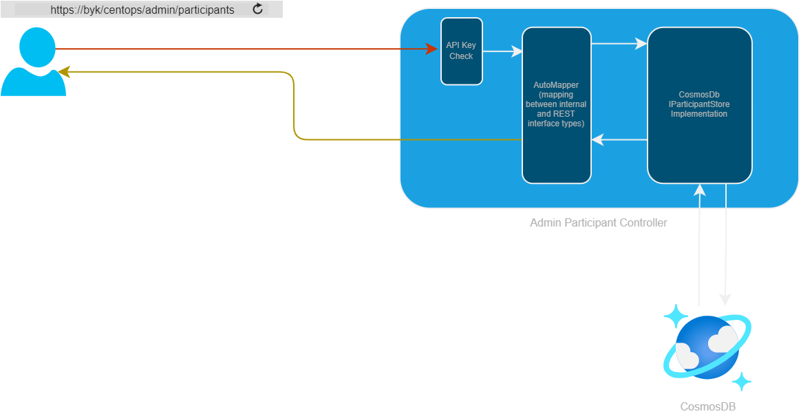

# CentOps Implementation

CentOps implemented in .NET 6.0 with C#

## Technologies Used and Their Function

.NET's [Web API](https://docs.microsoft.com/en-us/aspnet/core/web-api/?view=aspnetcore-6.0) is used to implement RESTful endpoints.
APIs are implemented with 'Controllers' which represent the operations one might perform on an entity managed by this service.

As with any RESTful service, operations are defined by HTTP Verbs, GET to read, POST to create, etc...)

[Swagger](https://swagger.io/) implemented using the [Swashbuckle](https://github.com/domaindrivendev/Swashbuckle.AspNetCore) library is used to produce OpenAPI Specs for the created APIs and will host a simple user interface to allow APIs within this project to be called when run in Debug mode.

[Automapper](https://automapper.org/) is used to easily map between external types and internal DTOs.  e.g. [CreateUpdateParticipantModel.cs](../../src/CentOps.Api/Models/CreateUpdateParticipantModel.cs) and the internal [ParticipantDto.cs](../../src/CentOps.Api/Services/ModelStore/Models/ParticipantDto.cs).  Very simple mapping between these types is specified in [AutoMapperProfile.cs](../../src/CentOps.Api/AutoMapperProfile.cs)

[CosmosDB](https://docs.microsoft.com/en-us/azure/cosmos-db/) is used as a data store via implementations of `IParticipantStore` and `IInstitutionStore`.

[Microsoft.CodeAnalysis.NetAnalyzers](https://github.com/dotnet/roslyn-analyzers) are used to ensure best practice is used in code styling and language usage.  Violations of these rules will cause build failures.

[xUnit.Net](https://github.com/xunit/xunit) is a unit testing framework used by all tests.

[Coverlet](https://github.com/coverlet-coverage/coverlet) a unit test coverage measurement and reporting tool.  This project has a goal to meet at least 80% coverage.

[Stryker](https://stryker-mutator.io/) is a mutation testing framework used by this project to ensure tests written to meet coverage requirements are covering crucial areas.

## Implementation And Flow

Registered participants have Participant API Keys which they can use to interact with the `public` API.  The public API allows only a subset of the functionality and data provided by the CentOps service.  For instance, the public API only returns current active participants.

Only CentOps administrators (with a specific API key) can interact with the `admin` API.  This allows Participants to be created (with unique API keys) and removed from the Buerokratt ecosystem.  CentOps can view active/inactive & deleted participants.

Taking the case of an admin user requesting all participants:

1. GET request is issued to the admin version of the participants API.
2. The API Key is validated and calls without the correct API receive 401 (Unauthorized) as a response.
3. The Admin Participant 'Controller' handles the GET request calling the `Get()` function (also decorated with the `[HttpGet]` attribute to indicate it will handle requests with the HTTP GET Verb)
4. Dependency Injection will give the Admin Participant Controller an implementation of the `IParticpantStore` interface.  At time of writing this will be a CosmosDb backed implementation of this interface.
5. The CosmosDB implementation will query the configured data store and returned the participants found within.
6. Internal data types are mapped to external REST interface types using Automapper and returned as a collection to the caller with the HTTP status code 200 (OK).

## Configuration

Configuration of this service can be done in many ways.  [appsettings.json](../../src/CentOps.Api/appsettings.json) is one approach which will be used in local development.  Another is using specifically named environment variables.  Both approaches are documented below.

### CosmosDb

These settings correspond to the CosmosDb connection used by CentOps.

| Setting    | Purpose                       |  appSettings.json | yaml environment |
|:------------------|:------------------------------| ------------------|--------|
| Account | Specifies the Cosmos Account to be used. |"Account": "`CosmosAccountName`" | COSMOSDB__ACCOUNT=`CosmosAccountName`
| Key      | Specifies the read/write key corresponding to the Cosmos Account| "Key": "`CosmosAccountKey`" | COSMOSDB__KEY=`CosmosAccountKey`
| DatabaseName | The name of the Database instance corresponding to the account | "DatabaseName": "`DatabaseName`" | COSMOSDB__DATABASENAME=`DatabaseName`
| ContainerName | The container which stores the entities used by CentOps | "ContainerName": "`ContainerName`" | COSMOSDB__CONTAINERNAME=`ContainerName`

### ConnectionStrings

Contains the setting for the Admin Api Key.  Current deployment generate a random complex key which is held in Azure Key Vault and piped into CentOps via configuration.

| Setting    | Purpose                       |  appSettings.json | yaml environment |
|:------------------|:------------------------------| ------------------|--------|
| AdminApiKey  | The key configured and required by the Admin API.  Note this key is a secret maintained by the deployment. |"AdminApiKey": "`ApiKeyValue`" | CONNECTIONSTRINGS__ADMINAPIKEY=`ApiKeyValue`

### Cors

Cross Origin Resource Sharing Settings specified here.

| Setting    | Purpose                       |  appSettings.json | yaml environment |
|:------------------|:------------------------------| ------------------|--------|
| AllowedOrigins  | A collection of allowed origins which can call this API. | "AllowedOrigins": [`OriginHost`] | CORS__ALLOWEDORIGINS__0=`OriginHost`

### FeatureToggles

Optional functionality is controlled by Feature Toggles.

| Feature Toggle    | Purpose                       |  appSettings.json | yaml environment |
|:------------------|:------------------------------| ------------------|--------|
| UseInMemoryDataStore | Enables an In-memory data store which can be used for testing purposes only |"UseInMemoryStore": `true` | FEATURETOGGLES__USEINMEMORYSTORE=`true`

## Notes

The current registration process differs slightly from the design in that API keys are generated by the CentOps administrator rather than being created by the service.

The backlog item [CentOps: The Admin Participant Creation API Should Create The API Key](https://github.com/buerokratt/CentOps/issues/78) covers this.

In-memory implementations of `IParticipantStore` and `IInstitutionStore` exist:

- [InMemoryInstitutionStore](../../src/CentOps.Api/Services/InMemoryInstitutionStore.cs)
- [InMemoryParticipantStore](../../src/CentOps.Api/Services/InMemoryParticipantsStore.cs)